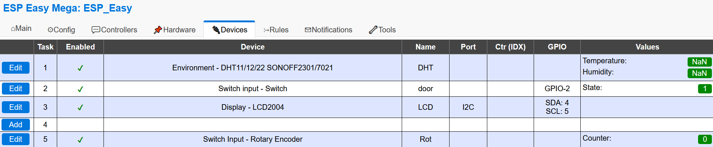

########
README
########

Simple client to access and controll ESPs that run ESPEasy in your local network.

    
********
ESPEasy
********

    **This project is not related to the ESPEasy project.
    It only provides a python class to control an device running ESPEasy**

You can run the `ESPEasy Firmware <https://github.com/letscontrolit/ESPEasy>`_ firmware on ESP8266 devices, for example the NodeMCU.

********************
Configuration files
********************
espisy uses config files (.ini files) within the package. Other configurations, like esp specific settings, a subnet for 
scanning etc. are stored in .yaml files for easier access. You can find all .yaml finds in one directory. Standard, is ``/.espisy`` in your 
home directory, but you can change it in the .ini file. Espisy comes with a script ``espisy_setup.py`` that will lead you through the first steps and (hopefully)
leave you with working settings.

******
Usage
******

.. _create:

Create an ESP device
=====================

.. note::
    **You should always use the classmethod** :meth:`~~espisy.core.ESP.add` **to add a new ESP device**

The ESP has a static register which keeps track of the ESP instances. It is possible to refer to every created ESP with
the :meth:`~espisy.core.ESP.get` method. This was implemented, because it simplifies the dynamic instantiation of ESP devices. A thing I needed pretty soon during development.

If you want to access a specific ESP device faster, you can of course use it with your own variable as usual.

.. code-block:: python

    ESP.add("192.0.0.255")
    my_esp = ESP.get("192.0.0.255")
    # do stuff with my_esp

    # you can also access the ESP with the name you gave it in the ESPEasy frontend
    my_esp = ESP.get("garden")

Scan the network
=================

You can scan your network for ESPEasy devices.
configure the network (ipv4 with suffix) in the esp.yaml file or pass it as argument to :meth:`~espisy.core.ESP.scan_network`

.. code-block:: python

    ESP.scan_network("192.168.0.0/24")

    # or with config file:
    # esp.yaml:
    #   ipv4network: 192.168.0.0/24
    ESP.scan_network()

    ESP.get("living room")

Devices
========

.. versionadded:: 0.3.0

Espisy comes with a hand full of devices that are currently supported by ESPEasy. Every device inherits the :class:`~espisy.devices.Device`
base class, which implements the most basic properties, like the name, a parent and the current state.

Supported devices - except for :ref:`gpio` - can be instantiated by calling the Device constructor with the 
device name from ESPEasy (fifth column in the picture below) and a parent esp device.

Currently supported devices and the corresponding device class are:

- "Environment - DHT11/12/22  SONOFF2301/7021": :class:`~espisy.devices.DHT`
- "Environment - DHT12 (I2C)": :class:`~espisy.devices.DHT`
- "Switch input - Switch": :class:`~espisy.devices.Switch`
- "Display - LCD2004": :class:`~espisy.devices.Display`
- "Display - OLED SSD1306": :class:`~espisy.devices.Display` (not tested)
- "Display - OLED SSD1306/SH1106 Framed": :class:`~espisy.devices.Display` (not tested)
- "GPIO": :class:`~espisy.devices.GPIO`
- "Switch Input - Rotary Encoder": :class:`~espisy.devices.Rotary`
- "Generic - MQTT Import": :class:`~espisy.devices.MQTT`

.. note::

    You should use the :meth:`~espisy.core.ESP.device` method of :class:`~espisy.core.ESP` objects.
    It keeps track of the devices and you do not need to store your devices in dozens of variables or lists.
    
If you call the method with the name you set in ESPEasy, the class automatically detects the real device type and 
creates a device. The name **does not** have any impact on the class detection. 
You can create a DHT device that is called "LED". If it has the name "LED" in ESPEasy and is set up as a DHT, you 
will be able to read the temperature and humidity from your "LED" device.

Although devices have a :meth:`~espisy.devices.Device.refresh` method, it always refreshes **all** devices, because it fires 
the refresh method of its parent. This is intended behaviour, because it keeps the number of requests low.

.. code-block:: python

    ESP.add("192.0.0.69")
    esp = ESP.get("192.0.0.69")

    esp.device("DHT") # Will create a device called DHT
    esp.device("door switch") # Will create a device called door switch
    # You regain control of the device when you call the function again
    esp.device.("DHT").temperature # Will return the temperature value
    # Do other stuff
    # ...
    # Refresh all devices
    esp.refresh()
    # does the same as esp.device("DHT").refresh()

.. _gpio:

GPIO
=====

.. versionadded:: 0.3.0

GPIOs are special devices, because they need a GPIO number to work at all. You need to pass the number within the settings argument.
The general call is:

.. code-block:: python

    gpio = Device(<name>, <parent>, device_type="GPIO", settings={"pin":<gpio>})

Say you want to access GPIO 2 of an ESPEasy device at 192.0.0.69 to control a LED:

.. code-block:: python

    ESP.add("192.0.0.69")
    esp = ESP.get("192.0.0.69")
    gpio = Device("led", esp, device_type="GPIO", settings={"pin":2})
    # Now you can access the GPIO functions
    gpio.on()
    gpio.off()
    gpio.toggle()

.. _testing:

Testing
========

.. note::
    You only need this if you want to develop in espisy. Normal user do not need this section.

    
.. versionchanged:: 0.3.0 removed dummy tests

.. warning::
    The test toggles GPIO 2 high and low a few times. Only wire the GPIO up to LED or something if you know what you are doing.

The testing module that comes with espisy can be executed with a real ESP. If you want to test automatically with a real ESP, please set up an ESPEasy device like this:

+----------------------------+--------+------+
| Device                     | Name   | GPIO |
+============================+========+======+
| Switch -                   | "door" | 2    |
|                            |        |      |
| input Switch               |        |      |
+----------------------------+--------+------+
| Environment -              | "DHT"  | 14   |
| DHT11/12/22SONOFF2301/7021 |        |      |
+----------------------------+--------+------+

Start the test with `--ip xxx.xxx.xxx`

.. code-block:: python

    python test_esp --ip 192.0.0.255
